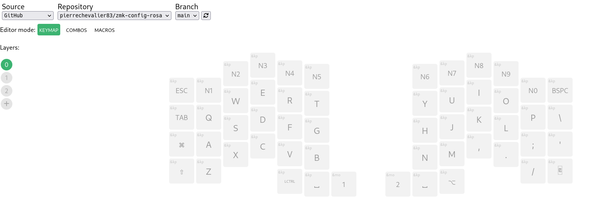

# Keymap Editor - Rosa

This is a customization of the ZMK config for the Rosa keyboard with machine
readable layout and keymap definitions for use with @nickcoutsos' [keymap-editor](https://github.com/nickcoutsos/keymap-editor) tool.

